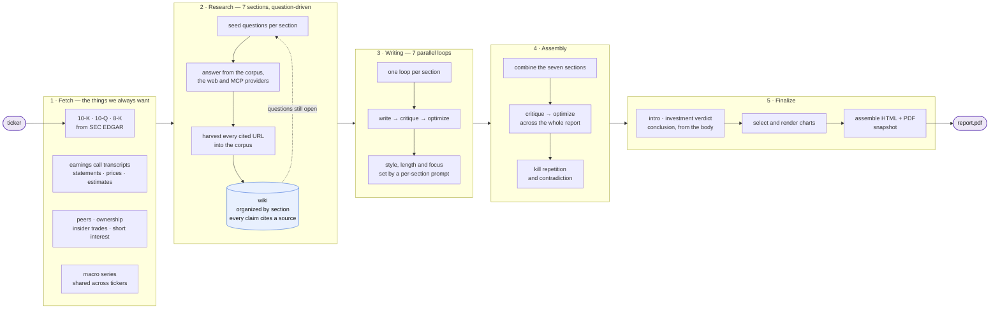
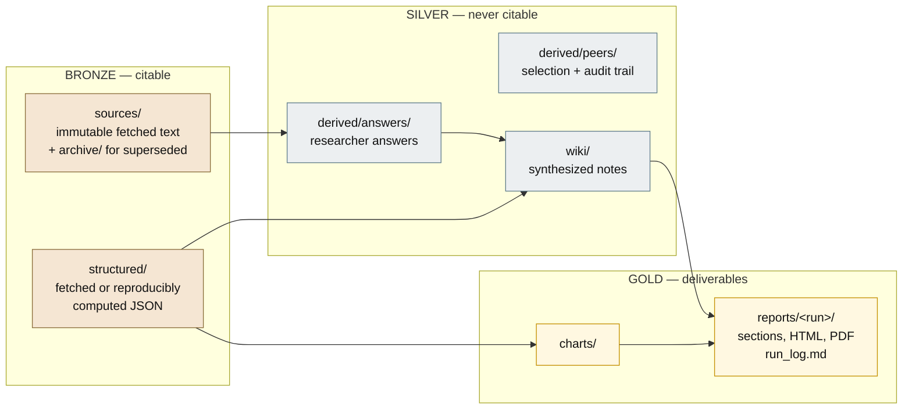
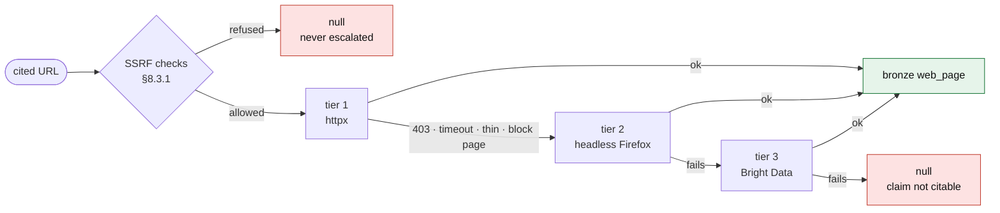

# SRA6 — Stock Research Agent

Writes a cited, chart-illustrated equity research report for a ticker, from a
persistent per-ticker knowledge base that grows across runs.

It is a skills-based agent that draws inspiration from Anthropic's
[equity-research plugin](https://github.com/anthropics/financial-services/tree/main/plugins/vertical-plugins/equity-research/skills),
combined with the wiki-centred research loop from Karpathy's
[LLM wiki flow](https://gist.github.com/karpathy/442a6bf555914893e9891c11519de94f):
agents do not write the report directly from sources. They
write facts into a wiki as they learn them, and the report is composed from the
wiki afterwards.

**Example output:** [SPCX initiation report](docs/examples/SPCX-2026-08-12.pdf)
— ~13,000 words across seven sections, Sell at a $38.13 fair value against a
$133.29 price.

The organizing rule is that **every sentence in the report terminates in a
fetched document**. Wiki prose is never evidence, however good it is: a research
answer is an audit record, a wiki page is a working note, and only data a
fetcher pulled off the wire can be cited.

`sra6-spec.md` is authoritative. This README is the map.

---

## The pipeline



**1 · Fetch.** Deterministic, no model involved. Filings, transcripts,
statements, prices, estimates, price targets, the calendar, peers, ownership and
macro — each with its own freshness policy, so a re-run only re-fetches what has
gone stale.

**2 · Research.** The report body is seven sections. Each seeds a list of
questions; agents answer them from the local corpus first, then the web and MCP
data providers. Everything learned is written to the wiki, organized by section,
with each claim citing the source it came from. Up to three rounds — a round
adds the questions the last one exposed.

**3 · Writing.** Seven write → critique → optimize loops, one per section,
running in parallel. They consume wiki facts, not raw sources, and each is
steered by a prompt defining style, length and focus.

**4 · Assembly.** The seven sections are combined and put through a
critique → optimize pass over the whole report — the pass that catches
repetition and contradiction between sections, which no section-level critic can
see.

**5 · Finalize.** The intro, investment verdict and conclusion are written last,
from the finished body rather than from a plan. Charts are selected and
rendered, then the report is assembled to HTML and PDF and snapshotted.

### The seven sections

| Section | Wiki page | Base word target |
|---|---|---|
| Company Profile | `profile` | 1,000 |
| Business Model | `business_model` | 1,300 |
| Supply Chain Positioning | `supply_chain` | 1,650 |
| Competitive Landscape | `competitive` | 1,750 |
| Financial Strength | `financial` | 2,300 |
| Valuation | `valuation` | 2,300 |
| Risks | `risk_news` | 2,700 |

Defined in `sections.yaml` with per-section seed questions and hard checks.
`length_presets` scale all seven together — `short` 0.4×, `standard` 0.75×,
`long` 1.0×.

---

## What this adds to the Anthropic reference flow

**Bronze/Silver/Gold data pipeline** with metadata preserving link chain back to 
bronze primary source data as we summarize and synthesize research.

**LLM-Wiki as reference database** . 
**Incremental updates.** The wiki is durable, so when news breaks you refresh the
affected evidence, run directed research on the specific question, redraft the
sections it touched, and re-assemble — without repeating the research phase.
`/sra-update` does this; a full cold build is the start, not the full cadence.

**A critic-optimizer loop per section, then again on the whole report.** Two
levels, because they catch different things: a section critic enforces that
section's word target, evidence and argument, while the report-level pass sees
the repetition and contradiction between sections. This is what makes the output
*steerable* — length, style and focus are prompt parameters rather than
properties of whatever the model produced. And because the critique step is
itself a scored evaluation, an effective eval makes the writing prompts
optimizable in the Karpathy autoresearch style: the critic's score is the
objective, the prompts are the parameter.

**Everything reproducible is code.** `sra.py` owns fetching, freshness, ID
minting, citation resolution, validation, chart rendering and assembly. Skills
and agents own judgment only, and never do their own bookkeeping — every state
transition goes through a CLI command, so it is testable offline and identical
every run.

**Low-cost market data, from provider APIs.** FMP for peers and transcripts,
yfinance for statements, prices and estimates, SEC EDGAR direct for filings,
FRED for macro, and **OpenBB** for easy integration of manysources. OpenBB 
normalizes ~50 upstreams behind one schema, so FINRA short interest and FMP 
Form 4 data arrive comparably shaped.
---

## The knowledge base

Three layers, and the boundary between them is enforced by `sra.py validate`,
which fails the build rather than warning.



Two rules do most of the work:

- **Sources are immutable.** A refresh writes a new file carrying `supersedes:`;
  nothing is overwritten, so a citation made last month still resolves to the
  bytes that were read.
- **A report citation must terminate in bronze.** A claim whose only support is
  a researcher's answer is dropped, not softened.

Every fetched artifact carries provenance — source, url, `fetched_at`, `as_of`,
and the exact command that produced it.

---

## Fetching a model-chosen URL

`fetch-urls` is the one place the system fetches an address a model picked, which
makes it both the security boundary and the place evidence is actually lost. A
single HTTP client lost **38% of cited URLs** on a recent build, almost all of it
publisher bot-blocking rather than dead links.



- **An SSRF refusal never escalates.** Retrying a private-address rejection
  through a browser is the exact bypass the control exists to prevent. Tiers 2
  and 3 follow redirects internally, so the final URL is re-validated before
  anything is recorded (§8.3.2).
- **A thin body or a bot wall is a failure, not a capture.** Replaying 63 failed
  URLs showed every body still thin at tier 3 was a wall, a 404 or an auth page —
  none was a real short article. Storing one would put a publisher's refusal into
  the corpus under a plausible id, where a writer can cite it as fact.
- Tiers 2 and 3 are optional. Without Playwright or a Bright Data key they report
  themselves unavailable and the chain falls through.

---

## Budgets

A cold build is gated by `check_budgets`:

```text
≤100 model subagents
≤6M tokens        (target ≤3M)
≤60 minutes
```

Every stage names its own effort; nothing inherits the session default silently
(§21.1). Effort is the preferred dial — lowering it shortens tool loops, which
cuts input tokens faster than it cuts turns. Judgment stages (critic, conclusion,
whole-report critique, lint, synthesizer) run `high`; retrieval and
worklist-applying stages run `medium`.

Because the **Agent tool takes `model` but no `effort`**, skill-dispatched agents
get effort from `.claude/agents/*.md` frontmatter only. Workflow `agent()` takes
both, so `workflows/*.js` set it per stage in a `STAGE_TUNING` map.

> **A cautionary result.** Prefetch research once ran on the harness-provided
> `deep-research` Workflow. Being harness-owned, it accepted no budget, model or
> effort — and one build measured **728 subagents and 20.65M input tokens in 34
> minutes, 93% of the entire run**, to produce 202 URLs whose prose was then
> discarded. It is retired (§11.2). An unbudgeted delegation dominates every
> budgeted one, so when a run overruns, look first at the stage with no ceiling —
> not the stage with the largest share of a well-behaved run.

---

## Commands

| Command | Purpose |
|---|---|
| `init T` / `status T` | initialize ticker / report stale bronze |
| `prefetch T [--kinds] [--stale-only] [--peers]` | ticker gather |
| `prefetch-macro [--series] [--stale-only]` | shared macro gather |
| `prefetch-peers T [--stale-only]` | metric bronze for selected comparables |
| `peers-candidates T` / `peers-select T` | peer selection |
| `fetch-urls T [--from ID] [--max N] [--parallel N] [--retry-failed]` | harvest cited URLs |
| `manifest T` / `show T ID` / `grep T PATTERN` / `eval-retrieval T` | retrieval |
| `validate T` / `wiki-lint T` | fatal gate / advisory silver checks |
| `questions T` / `add-questions T` / `mark-answered T` / `invalidate T` | research ledger |
| `record-attempt T` / `drop-question T` | ledger transitions |
| `wiki-log T` / `wiki-index T` / `mark-dirty T` | wiki bookkeeping |
| `charts T [--verdict]` / `assemble T` / `snapshot T` | report rendering |
| `lint-render T [--run R]` | check HTML+PDF for leaked CSS or template text |
| `run-log T [--run R]` | assemble the run's audit log |

Skills: `/sra-build`, `/sra-prefetch`, `/sra-peers`, `/sra-research`, `/sra-lint`,
`/sra-write`, `/sra-chartbook`, `/sra-assemble`, `/sra-update`, `/sra-status`.

---

## Setup

Requires Python 3.12+ and [uv](https://docs.astral.sh/uv/).

```bash
uv sync
uv run playwright install firefox      # tier 2 of the fetch ladder
brew install ta-lib                    # macOS; needed by the technical fetcher
```

Provider keys go in `.env` at the repo root, loaded once by `sra.py`:

```text
SEC_FIRM, SEC_USER      required — SEC fair-access identity
FMP_API_KEY             peers, transcripts, ownership
FRED_API_KEY            macro series
OPENBB_PYTHON           optional — interpreter that has OpenBB installed
BRIGHTDATA_API_KEY      optional — tier 3 of the fetch ladder
PERPLEXITY_API_KEY      optional — the --kinds perplexity supplement
```

**OpenBB** is not a dependency of this project — it is 51 packages — so the
`ownership` fetcher shells out to an interpreter that has it. Point
`OPENBB_PYTHON` at any such environment; without it the kind degrades to a
warning and the build continues.

To give agents OpenBB's ~50 providers during research as well, add an MCP server
(`.mcp.json` is gitignored, since the path is machine-specific):

```json
{
  "mcpServers": {
    "openbb": {
      "command": "/path/to/venv/bin/openbb-mcp",
      "args": ["--transport", "stdio"]
    }
  }
}
```

MCP responses are **not citable on their own** (§8.3) — anything a report rests
on has to be persisted by a registered fetcher first.

Then:

```bash
uv run python sra.py init TOST
uv run python sra.py status TOST
```

…or ask for the whole thing: `/sra-build TOST`.

## Tests

```bash
uv run pytest -q -m "not integration"    # must stay green
uv run pytest -q -m integration          # hits live network APIs
```

Contract tests assert that the skills and agent files match the code they call —
a renamed command or a dropped safety rule fails there rather than mid-build.

## Layout

```text
sra.py                  deterministic driver CLI
lib/                    fetchers, provenance, validation, charts, rendering
  fetchers/urls.py      the failover ladder and URL harvest
  fetchers/ownership.py OpenBB, out of process
.claude/skills/         phase orchestration
.claude/agents/         researcher, writer, rater — effort set in frontmatter
workflows/              write_wave.js, polish_chain.js
prompts/                topic briefs, section briefs, rubrics
sections.yaml           the seven sections and their targets
templates/report.css    an HTML fragment spliced into pandoc's head, not a stylesheet
data/<TICKER>/          the knowledge base
docs/examples/          a finished report
sra6-spec.md            authoritative specification
```
